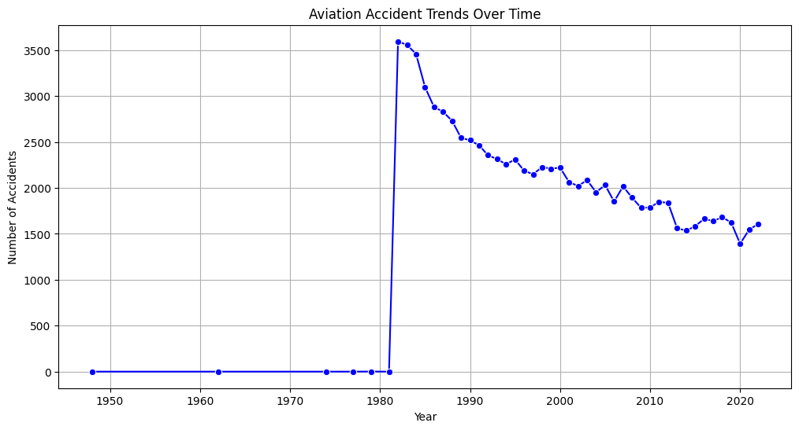
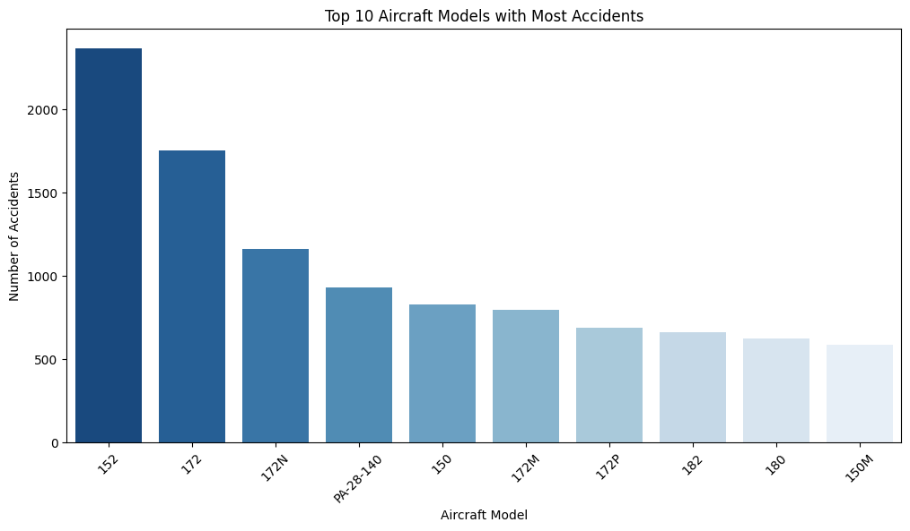
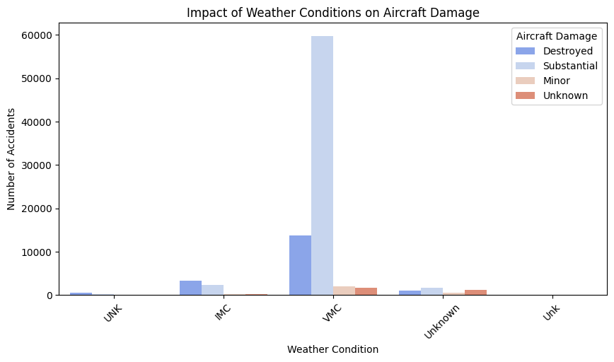

# Aviation Accident Analysis - README

## Overview
This project analyzes aviation accident data to identify trends, risks, and safety recommendations. The goal is to support aviation stakeholders in making informed decisions about aircraft safety, weather-related risks, and operational best practices.

## Business Understanding
### Stakeholder
The primary stakeholders are aviation companies, regulatory authorities, and aircraft operators looking to minimize accident risks and improve safety measures.

### Key Business Questions
1. **Which aircraft models have the highest accident rates?**
2. **How does weather impact accident severity?**
3. **What are the most critical flight phases where accidents occur?**

## Data Understanding and Analysis
### Source of Data
The dataset is sourced from the **National Transportation Safety Board (NTSB)** and includes aviation accident and incident reports from 1962 to 2023.

### Description of Data
- **Event Details**: Date, location, accident number
- **Aircraft Information**: Make, model, category, number of engines
- **Weather Conditions**: VMC (clear weather) vs. IMC (poor visibility)
- **Flight Phases**: Takeoff, landing, cruise, maneuvering, etc.
- **Injuries and Damage**: Fatalities, minor/serious injuries, aircraft damage

### Data Preprocessing Steps
To ensure data quality and consistency, the following preprocessing steps were applied:
1. **Missing Values Handling**:
   - Injury-related missing values were filled with `0`, assuming unreported cases meant no injuries.
   - Categorical missing values (e.g., `Weather_Condition`, `Aircraft_Category`) were filled with "Unknown".
2. **Data Cleaning**:
   - Standardized column names by replacing spaces and dots with underscores.
   - Converted `Event_Date` and `Publication_Date` to datetime format.
   - Removed duplicate records to maintain dataset integrity.
3. **Data Type Conversions**:
   - Converted numerical columns (e.g., `Number_of_Engines`, `Total_Fatal_Injuries`) to appropriate numeric types.
   - Standardized categorical columns to ensure uniformity.
4. **Feature Engineering**:
   - Extracted `Year` from `Event_Date` to analyze accident trends over time.
   - Created derived features for better insights (e.g., `Accident_Severity` based on injury count).

### Key Visualizations
1. **Accident Trends Over Time**

2. **Top 10 Aircraft Models in Accidents**B

3. **Weather Condition Impact on Aircraft Damage**S

## Conclusion
### Summary of Findings
1. **High-Risk Aircraft Models**: Cessna 152 and 172 have the highest accident counts, likely due to their widespread use in training.
2. **Weather Impact**: While most accidents occur in clear weather (VMC), accidents in IMC tend to be more severe.
3. **Critical Flight Phases**: Takeoff and landing are the riskiest phases, requiring improved safety protocols and pilot training.

### Recommendations
- **Aircraft Selection**: Prioritize lower-risk models for operations.
- **Pilot Training**: Enhance IMC training and emergency response skills.
- **Operational Safety**: Implement stricter maintenance and risk assessment protocols, especially for high-risk flight phases.

